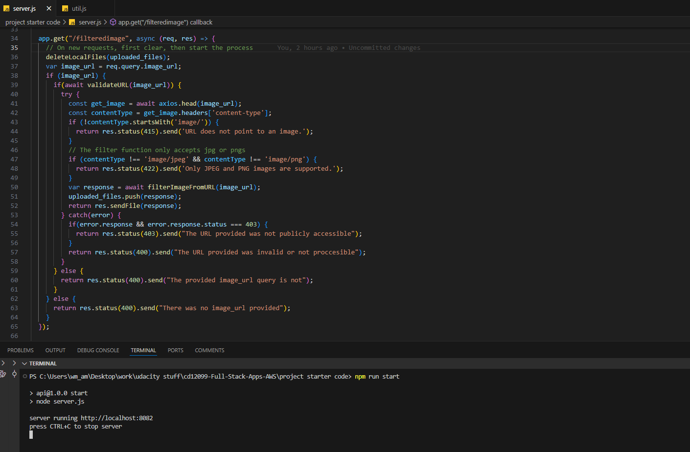
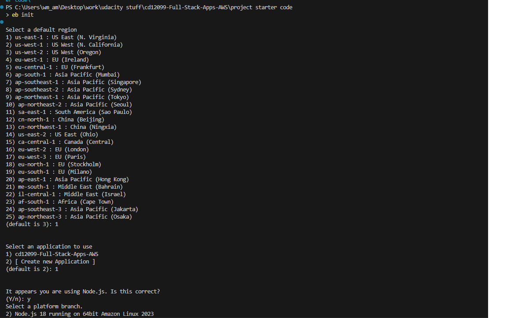
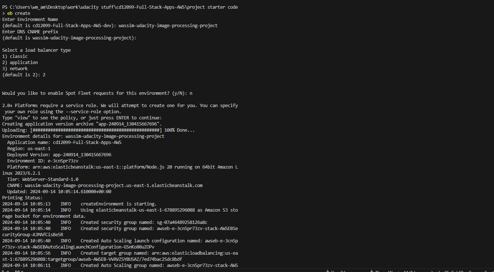
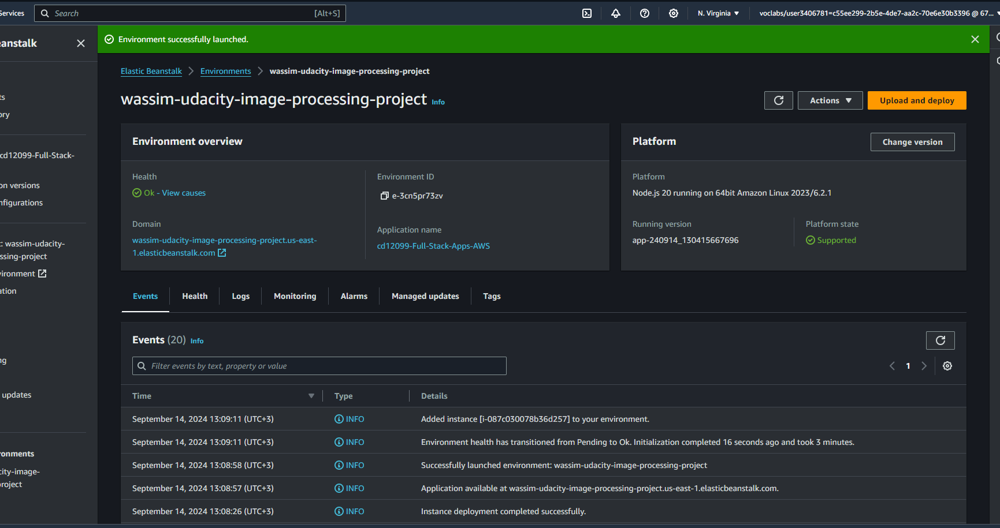

# Project Submission: Image Processing Microservice on AWS
### By: Wassim Mayyasi

#### EB_URL: *http://wassim-udacity-image-processing-project.us-east-1.elasticbeanstalk.com*

* *The project demonstrates a working NodeJS service*
* *The project demonstrates RESTFUL design principles*
* *The project demonstrates an appropriate use of HTTP status codes*

As seen in the screenshot, the application is running locally successfully without errors, and I handle everything using RESTful design patterns, handling all the statuses correctly (for different error instances and success

* *The project uses AWS ElasticBeanstalk’s CLI and Console Dashboard*

*eb init*

*eb create*

* *Dashboard after deployment success:*

